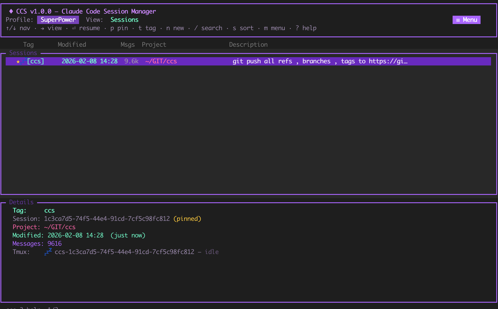
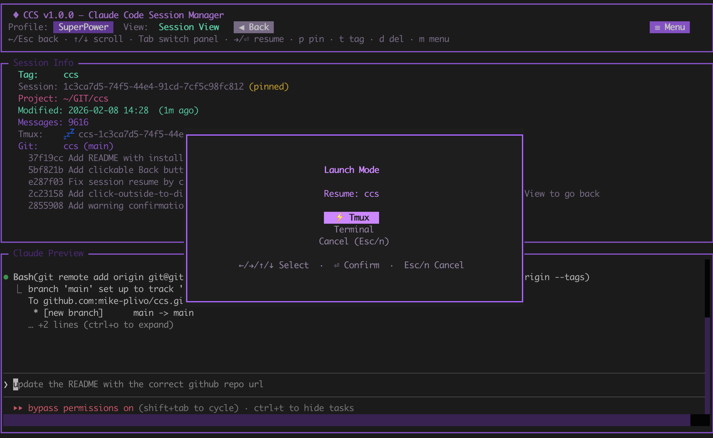
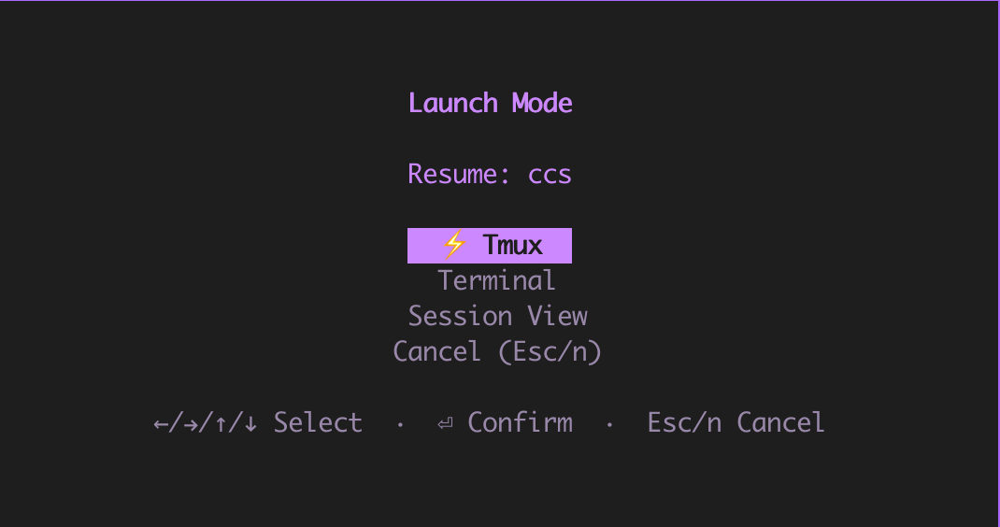
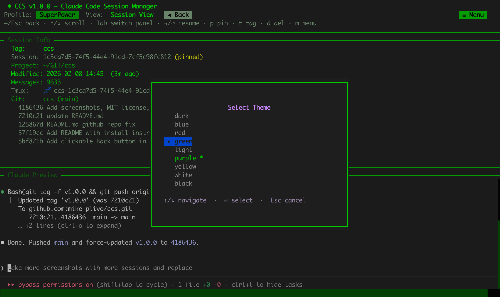
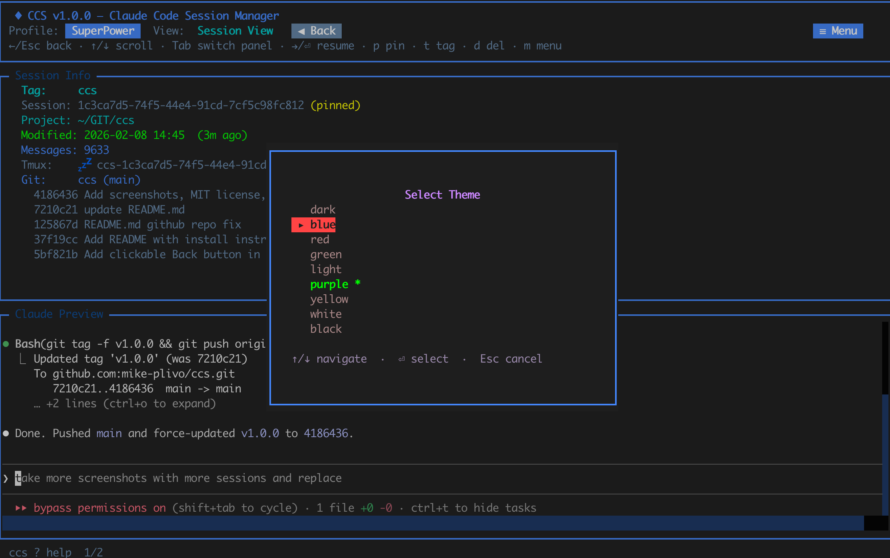
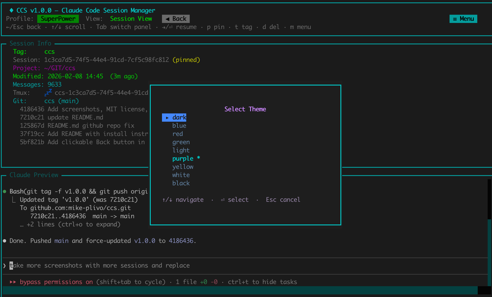
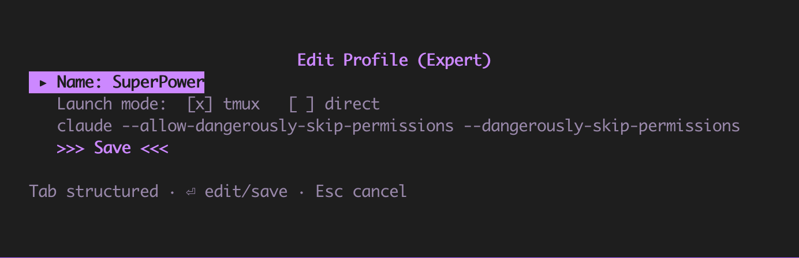

# CCS - Coding CLI Session Manager

A terminal UI and CLI for browsing, managing, and resuming sessions across multiple coding assistants: [Claude Code](https://docs.anthropic.com/en/docs/claude-code), [Codex](https://github.com/openai/codex), and [opencode](https://github.com/nicholasgriffintn/opencode).

**Original idea and first version created by: Varun Wahi**

CCS provides a unified interface for all your coding CLI sessions with session previews, tmux integration, profiles, themes, and bulk operations.

### Sessions List


### Session View with Launch Modal


### Launch Mode


### Themes
<p>



</p>

## Supported CLIs

| CLI | Sessions | Resume | New | Badge |
|-----|----------|--------|-----|-------|
| Claude Code | `~/.claude/projects/*.jsonl` | Yes | Yes | `[C]` |
| Codex | `~/.codex/state_*.sqlite` | Yes | Yes | `[X]` |
| opencode | `~/.local/share/opencode/opencode.db` | Yes | Yes | `[O]` |

CCS auto-detects installed CLIs and their sessions. Each session shows a badge indicating which CLI it belongs to.

## Requirements

- Python 3.9+
- At least one supported CLI installed: [Claude Code](https://docs.anthropic.com/en/docs/claude-code), [Codex](https://github.com/openai/codex), or [opencode](https://github.com/nicholasgriffintn/opencode)
- Optional: [tmux](https://github.com/tmux/tmux) (for background session management)
- Optional: [git](https://git-scm.com/) (for repository info in session details)

## Install

```bash
# Install dependencies
pip install textual rich

# Clone and install
git clone https://github.com/mike-plivo/ccs.git
cd ccs
./install.sh
```

The install script copies `ccs.py` to `~/.local/bin/` and adds a shell alias. After install, restart your terminal or run `source ~/.zshrc` (or `~/.bashrc`).

### Manual install

```bash
pip install textual rich
cp ccs.py ~/.local/bin/ccs.py
chmod +x ~/.local/bin/ccs.py
alias ccs='python3 ~/.local/bin/ccs.py'
```

## Usage

```bash
ccs                  # Launch interactive TUI
ccs list             # List all sessions (all CLIs)
ccs resume <id|tag>  # Resume a session
ccs providers        # Show detected CLIs and status
ccs help             # Show all commands
```

### CLI Commands

```
ccs list                               List all sessions (all CLIs)
ccs scan [-n|--dry-run]                Rescan all sessions
ccs resume <id|tag> [-p <profile>]     Resume session
ccs resume <id|tag> --claude <opts>    Resume with raw CLI options
ccs new <name>                         New named session
ccs new -e [name]                      Ephemeral session (auto-deleted on exit)
ccs pin/unpin <id|tag>                 Pin/unpin a session
ccs tag <id|tag> <tag>                 Set tag on session
ccs tag rename <oldtag> <newtag>       Rename a tag
ccs untag <id|tag>                     Remove tag
ccs delete <id|tag>                    Delete a session
ccs delete --empty                     Delete all empty sessions
ccs info <id|tag>                      Show session details
ccs search <query>                     Search sessions
ccs export <id|tag>                    Export session as markdown
ccs profile list|info|set|new|delete   Manage profiles
ccs providers                          List CLI providers and status
ccs theme list|set                     Manage themes
ccs tmux list                          List running tmux sessions
ccs tmux attach <name>                 Attach to tmux session
ccs tmux kill <name>                   Kill a tmux session
ccs tmux kill --all                    Kill all ccs tmux sessions
```

## TUI Keyboard Shortcuts

### Sessions List

| Key | Action |
|-----|--------|
| `Up/Down` | Navigate sessions |
| `g / G` | Jump to first / last |
| `PgUp/PgDn` | Page up / down |
| `Right` | Open Session View |
| `Enter` | Resume session |
| `n` | New named session (prompts CLI choice) |
| `e` | New ephemeral session (prompts CLI choice) |
| `p` | Toggle pin |
| `t / T` | Set / remove tag |
| `d` | Delete session |
| `D` | Delete all empty sessions |
| `C` | Toggle continuation sessions |
| `k / K` | Kill tmux session / all |
| `Space` | Mark / unmark session |
| `u` | Unmark all |
| `s` | Cycle sort mode |
| `/` | Search / filter |
| `S` | Rescan all sessions |
| `r` | Refresh |
| `P` | Profile manager |
| `H` | Change theme |
| `m` | Open menu |
| `?` | Help |

### Session View

| Key | Action |
|-----|--------|
| `Tab` | Switch Info / Preview pane |
| `Up/Down` | Scroll focused pane |
| `Enter` | Resume session |
| `i` | Send text to tmux |
| `k` | Kill tmux session |
| `p` | Toggle pin |
| `t / T` | Set / remove tag |
| `d` | Delete session |
| `Left / Esc` | Back to sessions list |

## Continuation Sessions

When Claude Code runs out of context, it creates a new **continuation session** with a summary of the previous conversation. CCS detects these automatically and hides them by default to keep the session list clean.

- **Hidden by default** -- only root/parent sessions are shown with a `+N` badge indicating how many continuations exist
- **Toggle with `C`** -- press `C` to show/hide continuation sessions; when visible, they appear grouped under their parent with a `↳` prefix and dimmed text
- **Search includes all** -- searching always includes continuation sessions regardless of the toggle
- **Orphan promotion** -- if a continuation's parent was deleted, it's promoted to a standalone session
- **Bulk archive** -- use the menu (`m`) to delete all continuation sessions at once

## Tmux Expert Mode

Tmux Expert allows launching a session with **ephemeral environment variables** (e.g. AWS credentials, API keys). The variables are set inline on the CLI command and are never stored anywhere.

- Available in the Launch modal and the menu (`m`) as **Tmux Expert**
- Enter one `KEY=VALUE` per line (Ctrl+D to confirm, Esc to cancel)
- Variables are passed directly to the `claude` process and inherited by all its subcommands
- **On detach (Ctrl+B, D), the tmux session is automatically killed** to avoid preserving sensitive env vars

## Profiles



Profiles store launch configurations and are CLI-aware -- each profile targets a specific CLI (Claude, Codex, or opencode) and only shows relevant options for that CLI. When launching a session with a CLI that doesn't match the active profile, CCS prompts you to select an appropriate profile.

Create and manage profiles from the TUI (`P`) or CLI:

```bash
ccs profile list           # List all profiles
ccs profile info <name>    # Show profile details
ccs profile set <name>     # Set active profile
ccs profile new <name>     # Create new profile
ccs profile delete <name>  # Delete a profile
```

## Configuration

All CCS data is stored in `~/.config/ccs/`:

| File | Purpose |
|------|---------|
| `sessions.json` | Session metadata (tags, pins, ephemeral flags) |
| `session_cache.json` | Scan cache for faster startup |
| `ccs_profiles.json` | Profile configurations |
| `ccs_active_profile.txt` | Currently active profile |
| `ccs_theme.txt` | Selected theme |

CCS reads session data from each CLI's storage location (see Supported CLIs above). CCS metadata (tags, pins, profiles) is stored separately and does not affect any CLI's configuration.

**Important:** Deleting a session in CCS permanently deletes the underlying session data. This action cannot be undone. As a safeguard, all delete operations require typing `DELETE` in uppercase to confirm.

## License

MIT
